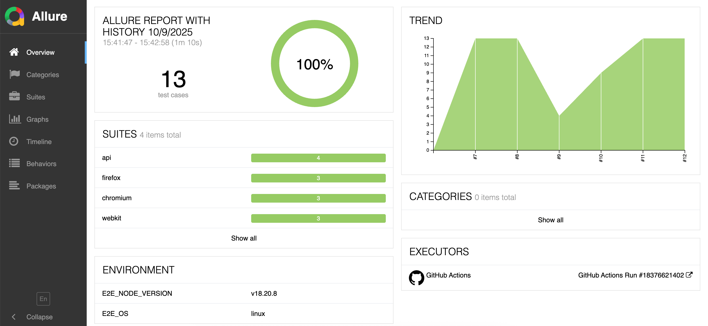
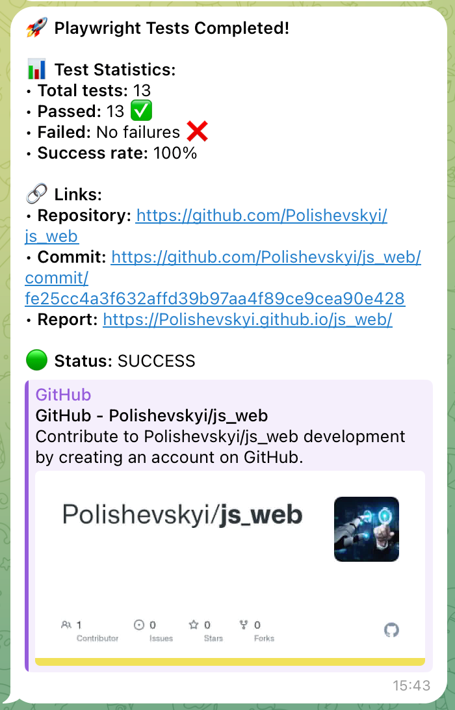

# SauceDemo Automation Framework

Senior-level E2E and API testing framework built with Playwright, featuring Allure reporting, Page Object Pattern, and CI/CD integration.

## 🚀 Quick Start

### 1. Installation

```bash
npm install
npx playwright install
```

### 2. Configuration

Copy `.env.example` to `.env` and configure as needed:

```bash
cp .env.example .env
```

### 3. Running Tests

#### E2E Tests

```bash
# E2E tests on Chrome
npm run test:e2e

# E2E on all browsers
npm run test:e2e:all-browsers

# With visible browser
npm run test:headed

# Specific browsers
npm run test:chrome
npm run test:firefox
npm run test:webkit
```

#### API Tests

```bash
# API tests only
npm run test:api
```

#### All Tests

```bash
# E2E (Chrome) + API together
npm run test:all

# Everything (all browsers + API)
npm test
```

## 📊 Reports

### Allure Report

```bash
npm run allure:generate    # Generate report
npm run allure:serve        # Open report
```

**Report Preview:**


## 🧪 Tests

### E2E Tests

- **login.spec.js** - Authentication and logout
- **shopping.spec.js** - Shopping cart operations (add/remove items)
- **checkout.spec.js** - Complete checkout flow with generated data

### API Tests

**Positive tests:**

- **createPet.spec.js** - Create pet and validate response
- **getPet.spec.js** - Get pet by ID and validate response
- **updatePet.spec.js** - Update pet and validate response
- **deletePet.spec.js** - Delete pet and validate status

## 📁 Project Structure

```
├── config.js                   # Test configuration (timeouts, workers, viewports)
├── playwright.config.js        # Playwright configuration
├── send-telegram-notification.sh # Telegram notification script
├── .env                        # Environment variables
├── .env.example                # Environment template
├── wiki/                       # Documentation images and assets
│
├── helpers/                    # Shared utilities
│   └── logger.js               # Logger for E2E and API (Allure steps, Proxy logging)
│
├── fixtures/                   # Playwright fixtures
│   ├── e2eFixtures.js          # E2E fixtures (Page Objects)
│   └── apiFixtures.js          # API fixtures (Steps)
│
├── data/                       # Test data generators
│   ├── e2eGenerators.js        # Faker for E2E (checkout data)
│   ├── apiGenerators.js        # Faker for API (pet data)
│   └── testData.js             # Static test data (users, products)
│
├── src/
│   ├── e2e/                    # E2E framework
│   │   ├── pages/              # Page Objects (= E2E steps)
│   │   │   ├── BasePage.js     # Base class with common methods
│   │   │   ├── LoginPage.js
│   │   │   ├── ProductsPage.js
│   │   │   ├── CartPage.js
│   │   │   ├── CheckoutPage.js
│   │   │   └── locators/       # Selectors separated from logic
│   │   │       ├── LoginPageLocators.js
│   │   │       ├── ProductsPageLocators.js
│   │   │       ├── CartPageLocators.js
│   │   │       └── CheckoutPageLocators.js
│   │   └── constants/          # E2E constants
│   │       └── testData.constants.js  # Page titles, messages, timeouts
│   │
│   └── api/                    # API framework
│       ├── models/             # Data models
│       │   ├── BaseModel.js    # Base model class
│       │   ├── CreatePetRequest.js
│       │   ├── CreatePetResponse.js
│       │   └── comparison/     # Model comparison system
│       │       ├── modelAssertions.js
│       │       ├── modelComparator.js
│       │       ├── modelComparisonConfig.js
│       │       └── modelRules.json
│       ├── steps/              # Business logic layer (= API steps)
│       │   └── petSteps.js
│       └── utils/              # HTTP utilities
│           ├── httpClient.js   # Playwright APIRequestContext wrapper
│           ├── requester.js    # Request handler
│           ├── httpStatus.js   # HTTP status codes
│           └── endpoints.js    # API endpoints configuration
│
├── tests/
│   ├── e2e/                    # E2E tests
│   │   ├── login.spec.js
│   │   ├── shopping.spec.js
│   │   └── checkout.spec.js
│   └── api/                    # API tests
│       ├── createPet.spec.js
│       ├── getPet.spec.js
│       ├── updatePet.spec.js
│       └── deletePet.spec.js
│
└── .github/
    └── workflows/              # CI/CD
        └── playwright-tests.yml  # E2E and API tests workflow
```

## 🏗️ Architecture

### E2E Testing (UI)

**Page Object Pattern:**

- Each page is a separate class with encapsulated methods
- `BasePage` - base class with common methods (click, fill, assertions)
- Page Objects contain only business logic (>1 actions)
- Simple actions are called directly through BasePage

**Example usage:**

```javascript
const { test } = require('../../fixtures/e2eFixtures');

test('Login test', async ({ loginPage, productsPage }) => {
  await loginPage.navigate();
  await loginPage.login(username, password);
  await productsPage.assertProductsPageDisplayed();
});
```

**Key features:**

- ✅ Locators separated from logic
- ✅ Automatic logging via Proxy
- ✅ Centralized assertions in BasePage
- ✅ Faker for test data generation

### API Testing

**Steps Pattern:**

- `PetSteps` - business logic for API operations
- `Requester` - universal HTTP client wrapper
- `Models` - data models with JSON serialization
- `Model Comparison` - automatic request/response validation

**Example usage:**

```javascript
const { test, expect, HTTP_STATUS, assertThatModels } = require('../../fixtures/apiFixtures');

test('Create Pet', async ({ petSteps }) => {
  const { requestData, responseData, status } = await petSteps.createPet();

  expect(status).toBe(HTTP_STATUS.OK);

  const expectedResponse = new CreatePetResponse(requestData);
  await assertThatModels(expectedResponse, responseData).match();
});
```

**Key features:**

- ✅ Playwright APIRequestContext (not Axios)
- ✅ Automatic model validation
- ✅ Flexible field comparison system
- ✅ Faker for pet data generation
- ✅ Centralized endpoints and HTTP statuses

### Separation of Concerns

- **E2E and API** separated in `src/e2e/` and `src/api/`
- **Fixtures** centralized in `fixtures/` directory
- **Data generators** centralized in `data/` directory
- **Locators** separated from page logic
- **Constants** separated by test type
- **Logger** shared across all tests
- **Config** in separate files (config.js, .env)

### Data Generation

- **Faker.js** for E2E (checkout data) and API (pet data)
- **testData.js** for static data (users, products)
- Centralized in `data/` directory

### Logging & Reporting

**Automatic logging:**

```javascript
// Via Proxy - automatically logs all methods
→ LoginPage.navigate()
→ LoginPage.login()
→ PetSteps.createPet()
```

**Allure integration:**

- ✅ Steps automatically added to Allure
- ✅ Screenshots on failure
- ✅ Video recording on failure
- ✅ Trace files for debugging
- ✅ Environment info (Node version, OS)
- ✅ Trends and categories

**Allure categories example:**

- Ignored tests - skipped tests
- Product defects - failed assertions
- Test defects - broken tests

## 📝 How to Add New Tests

### New E2E Test:

**1. Create Page Object (if needed):**

```javascript
// src/e2e/pages/NewPage.js
const BasePage = require('./BasePage');

class NewPage extends BasePage {
  async doSomething() {
    await this.click(this.locators.button);
    await this.assertText(this.locators.title, 'Expected');
  }
}
module.exports = NewPage;
```

**2. Add to fixtures:**

```javascript
// fixtures/e2eFixtures.js
newPage: async ({ page }, use) => {
  await use(new NewPage(page));
};
```

**3. Write test:**

```javascript
// tests/e2e/newTest.spec.js
const { test } = require('../../fixtures/e2eFixtures');

test('New test', async ({ newPage }) => {
  await newPage.navigate();
  await newPage.doSomething();
});
```

### New API Test:

**1. Add endpoint:**

```javascript
// src/api/utils/endpoints.js
NEW_ENDPOINT: {
  url: '/resource',
  method: 'post',
  responseModel: ResponseModel,
}
```

**2. Add method to Steps:**

```javascript
// src/api/steps/petSteps.js
async newOperation(data) {
  const response = await this.requester.request(ENDPOINTS_KEY.NEW_ENDPOINT, { data });
  return { responseData: response.data, status: response.status };
}
```

**3. Write test:**

```javascript
// tests/api/newTest.spec.js
test('New API test', async ({ petSteps }) => {
  const { status } = await petSteps.newOperation(data);
  expect(status).toBe(HTTP_STATUS.OK);
});
```

## 💡 Best Practices

### E2E (UI) Tests:

**✅ DO:**

- Use Page Object Pattern
- Separate locators from logic
- Use fixtures for Page Objects
- Add wait strategies (waitForUrl, waitForLoadState)
- Generate dynamic data via Faker

**❌ DON'T:**

- Don't use sleep/delays
- Don't hardcode test data in tests
- Don't duplicate code - extract to Page Objects
- Don't mix assertions with actions in Page Objects

### API Tests:

**✅ DO:**

- Use Steps for business logic
- Validate models via assertThatModels
- Generate data via Faker (generatePet)
- Check status codes separately
- Use Models for request/response

**❌ DON'T:**

- Don't make direct HTTP calls in tests
- Don't hardcode endpoints in tests
- Don't duplicate validation logic
- Don't skip status code verification

### General:

**✅ DO:**

- One test = one assertion (Single Responsibility)
- Use describe for grouping
- Write clear test names
- Add comments only where needed

**❌ DON'T:**

- Don't create test dependencies
- Don't use global variables
- Don't ignore lint/format warnings

## 🔧 Code Quality

```bash
npm run lint           # Check code
npm run lint:fix       # Auto-fix issues
npm run format         # Format with prettier
```

## ⚙️ Configuration

### config.js - Static Settings

```javascript
{
  timeout: 60000,              // Test timeout
  retryCount: 0,               // Retry count on failure (local)
  workers: 4,                  // Parallel workers (local)

  // CI-specific settings
  ci: {
    retries: 3,                // 3 retries in CI
    workers: 3,                // 3 workers per browser in CI
  },

  navigationTimeout: 30000,    // Navigation timeout
  actionTimeout: 15000,        // Action timeout
  headless: true,              // Headless mode
  viewport: { width: 1920, height: 1080 }
}
```

### .env - Environment Variables

```env
# E2E Configuration
BASE_URL=https://your-app-url.com
STANDARD_USER=your_username
STANDARD_PASSWORD=your_password

# API Configuration
API_BASE_URL=https://api.example.com/v1

# Telegram Notifications (Optional)
TELEGRAM_BOT_TOKEN=your_telegram_bot_token
TELEGRAM_CHAT_ID=your_telegram_chat_id
```

**Benefits of separation:**

- Config can be changed without access to credentials
- .env contains sensitive information (not committed to git)
- .env.example provides template for quick setup

## 📈 CI/CD

### Setup GitHub Secrets

Before running tests in CI/CD, configure the following secrets in repository settings:

```
Settings → Secrets and variables → Actions → New repository secret
```

Required secrets:

- `BASE_URL` - Application URL for E2E tests
- `STANDARD_USER` - Test username for authentication
- `STANDARD_PASSWORD` - Test user password
- `API_BASE_URL` - API base URL for API tests
- `TELEGRAM_BOT_TOKEN` - Telegram bot token for notifications
- `TELEGRAM_CHAT_ID` - Telegram chat ID for notifications

### Automatic Triggers

GitHub Actions automatically runs tests on:

- Push to `main`, `master`, or `develop` branches
- Pull requests to these branches

### Manual Trigger

You can manually trigger tests from GitHub Actions tab with options:

**Browser selection:**

- `all` - runs tests on Chromium, Firefox, and WebKit
- `chromium` / `firefox` / `webkit` - specific browser

**Test type selection:**

- `all` - E2E + API tests
- `e2e` - only E2E tests
- `api` - only API tests

### Features

- ✅ Parallel execution on 3 browsers (matrix strategy)
- ✅ 3 workers per browser for faster execution
- ✅ 3 retries on test failure in CI
- ✅ API tests run only on Chromium (browser-independent)
- ✅ Automatic Allure report generation
- ✅ Report publishing to GitHub Pages with history (20 reports)
- ✅ Test artifacts retention (30 days)
- ✅ Environment variables from GitHub Secrets or defaults
- ✅ ESLint and Prettier checks before tests

## 📱 Telegram Notifications

### Setup Telegram Bot

**1. Create Bot:**
- Open Telegram and search for `@BotFather`
- Send `/newbot` command
- Follow instructions to create your bot and get the token

**2. Get Chat ID:**
- Add your bot to the desired chat/channel
- Send a message to the chat
- Get chat ID using this URL: `https://api.telegram.org/bot<YOUR_BOT_TOKEN>/getUpdates`

**3. Configure Secrets:**
Add the following secrets to GitHub repository:

```
TELEGRAM_BOT_TOKEN=your_bot_token_here
TELEGRAM_CHAT_ID=your_chat_id_here
```

### Notification Script

The `send-telegram-notification.sh` script automatically sends test results to Telegram after CI/CD execution.

**Features:**
- ✅ Automatic test statistics collection from Allure results
- ✅ Success rate calculation
- ✅ Status indicators (🟢 SUCCESS / 🔴 FAILED)
- ✅ Direct links to repository, commit, and test report
- ✅ HTML formatting for better readability
- ✅ Handles cases with zero tests gracefully

**Message Structure:**

```
🚀 Playwright Tests Completed!

📊 Test Statistics:
• Total tests: 25
• Passed: 23 ✅
• Failed: 2 ❌
• Success rate: 92%

🔗 Links:
• Repository: https://github.com/owner/repo
• Commit: https://github.com/owner/repo/commit/sha
• Report: https://owner.github.io/repo/

🟢 Status: SUCCESS
```

**Telegram Notification Preview:**


**Usage in CI/CD:**
The script runs automatically after tests in GitHub Actions workflow. To use locally:

```bash
# Set environment variables
export TELEGRAM_BOT_TOKEN="your_bot_token"
export TELEGRAM_CHAT_ID="your_chat_id"
export GITHUB_REPOSITORY="owner/repo"
export GITHUB_SHA="commit_sha"
export GITHUB_REPOSITORY_OWNER="owner"
export GITHUB_EVENT_REPOSITORY_NAME="repo"
export JOB_STATUS="success"  # or "failure"

# Run script
./send-telegram-notification.sh
```

## 🛠️ Technologies

- **Playwright** - E2E testing framework
- **Allure** - Advanced test reporting
- **Faker.js** - Test data generation
- **ESLint + Prettier** - Code quality
- **dotenv** - Environment variables management
- **GitHub Actions** - CI/CD pipeline

## 📋 Best Practices

- ✅ Page Object Pattern with separated locators
- ✅ Base class for shared logic
- ✅ Constants for all magic values
- ✅ Automatic test data generation
- ✅ Logging of all steps
- ✅ Separation of config and sensitive data
- ✅ Parallel test execution
- ✅ Detailed reports with screenshots and videos
